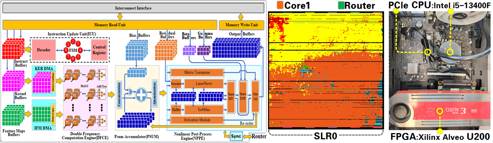
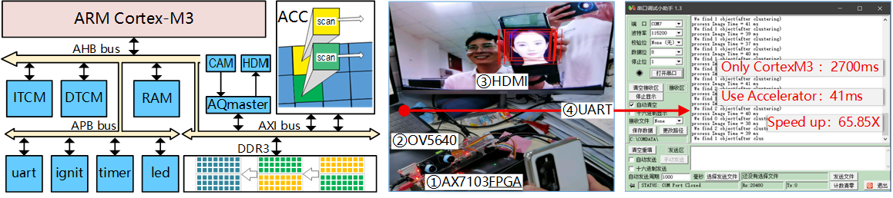
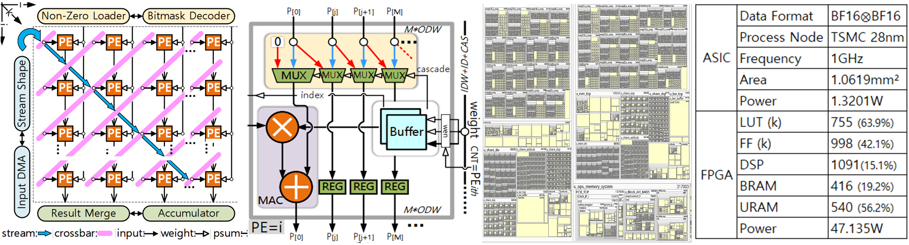
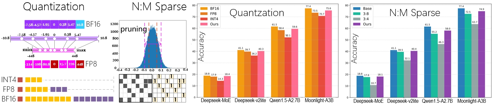

# 😄 Hi, I'm Shaoqiang Lu

💼 **Job Objective**: Digital Chip Design, AI Model Deployment  
🔻 Based: No. 1, Kaiyuan New Youth Plaza, Ningbo, Zhejiang, China  
🗓 Born: August 1997 (Age 28)&nbsp;&nbsp;&nbsp;&nbsp;&nbsp;&nbsp;&nbsp;&nbsp;&nbsp;&nbsp;🏠 Hometown: Guangxi, China  
📧 **Email**: [lushaoqiang@sjtu.edu.cn](#)  |  ☎️ **WeChat**: [lushaoqiang2022](#)💬  
🔗 ●&nbsp;  [Google Scholar](https://scholar.google.com/citations?hl=en&user=VMm9FnEAAAAJ)  &nbsp;&nbsp;&nbsp;&nbsp;●&nbsp;  [IEEE](https://ieeexplore.ieee.org/author/37090071689)  &nbsp;&nbsp;&nbsp;&nbsp;●&nbsp;  [ACM](https://dl.acm.org/profile/99661548970)  &nbsp;&nbsp;&nbsp;&nbsp;●&nbsp;  [GitHub](https://github.com/ShaoqiangLu)  &nbsp;&nbsp;&nbsp;&nbsp;●&nbsp;  [Patents](https://www.patentstar.com.cn/Search/ResultList?CurrentQuery=6ZmG5bCR5by6L0lO&type=cn)

---

## 💡 Research Interests
- Digital IC Design for AI Chips — FPGA or ASIC design targeting AI acceleration.
- Hardware/Software Co-Design for — Transformers, Mamba, and MoE-based large models.
- AI Compiler Development leveraging — a unified IR and ISA for efficient deploymentt.
- Algorithm-Level Optimization — quantization, sparsity, and fine-tuning for lightweight.
---

## 🎓 Education

- **Shanghai Jiao Tong University** &nbsp;&nbsp;&nbsp;&nbsp; Shanghai, China.  &nbsp;&nbsp;&nbsp;&nbsp;&nbsp;&nbsp;&nbsp;&nbsp;&nbsp;&nbsp;&nbsp;&nbsp;*2022.9 ~ 2026.6*  
  **Ph.D. degree in Integrated Circuits Engineering**, School of Electronic Information and Electrical Engineering  
  Graduate Thesis: Research on FPGA-based Overlay Processor Unit for Deep Learning Algorithms  
  
- **Xidian University** &nbsp;&nbsp;&nbsp;&nbsp;&nbsp;&nbsp;&nbsp;&nbsp;&nbsp;&nbsp;&nbsp;&nbsp;&nbsp;&nbsp;&nbsp;&nbsp;&nbsp;&nbsp;&nbsp;&nbsp;&nbsp;&nbsp;&nbsp;&nbsp;&nbsp; Xi’an, Shaanxi, China.  &nbsp;&nbsp;&nbsp;&nbsp;&nbsp;&nbsp;*2019.9 ~ 2022.6*  
  **Master’s degree in Integrated Circuit Design**, National Demonstration School of Microelectronics  
  Graduate Thesis: Research and Design of DDR4 PHY Interface Based on the DFI 4.0 Specification  
  Degree Course Ranking: 35/188 &nbsp;&nbsp;&nbsp;&nbsp; Total Evaluation Ranking : 2nd Year 8/188;&nbsp; 3rd Year 4/188  

- **Xidian University** &nbsp;&nbsp;&nbsp;&nbsp;&nbsp;&nbsp;&nbsp;&nbsp;&nbsp;&nbsp;&nbsp;&nbsp;&nbsp;&nbsp;&nbsp;&nbsp;&nbsp;&nbsp;&nbsp;&nbsp;&nbsp;&nbsp;&nbsp;&nbsp;&nbsp; Xi’an, Shaanxi, China.  &nbsp;&nbsp;&nbsp;&nbsp;&nbsp;&nbsp;*2015.9 ~ 2019.6*  
  **Bachelor’s degree in Integrated Circuit Design and Integrated Systems**  
  Undergraduate Thesis: Design of a Terahertz Planar Antenna Based on Wide Bandgap Semiconductor GaN  
  

&nbsp;&nbsp;📚**Key Courses**: Digital IC Design (96), Verilog HDL (95.6), FPGA Applications (95), Semiconductor Physics (93),   
&nbsp;&nbsp;&nbsp;&nbsp;&nbsp;&nbsp;&nbsp;&nbsp;&nbsp;&nbsp;&nbsp;&nbsp;&nbsp;&nbsp;&nbsp;&nbsp;&nbsp;&nbsp;&nbsp;&nbsp;&nbsp;&nbsp;&nbsp;&nbsp;&nbsp;&nbsp;&nbsp;&nbsp;
IC Process (91), EDA Practice (89), Analog IC Design, C Programming, Advanced Computer Architecture  
&nbsp;&nbsp;🌐**English Proficiency**: College English Test Band 4 (CET-4), Band 6 (CET-6)

---

## 📜 Published Papers 

> *👨‍🏫 Prof. [Lei He](https://scholar.google.com/citations?user=n_N-PJkAAAAJ&hl=en) – Principal Investigator (PI), Chair Professor at Eastern Institute of Technology, Tenured Professor at UCLA, IEEE Fellow*    

1. **[CCF-A, #1 author, DAC 2025](#)"MambaOPU: An FPGA Overlay Processor for State-space-duality-based Mamba Models" [**PDF**](https://ieeexplore.ieee.org/document/11132895)**  
   <ins>Shaoqiang Lu</ins>, Xuliang Yu, Tiandong Zhao, Siyuan Miao, Xinsong Sheng, Chen Wu, et al.   

2. **[CCF-B, #1 author, ICCAD 2025](#)"MoE-OPU: An FPGA Overlay Processor Leveraging Expert Parallelism for MoE-based Large Language Models"**  
   <ins>Shaoqiang Lu</ins>, Yangbo Wei, Junhong Qian, Chen Wu, Xiao Shi, Lei He.   

3. **[CCF-B, #1 author, TRETS Journal, ISEDA 2024](#)"MCoreOPU: An FPGA-based Multi-Core Overlay Processor for Transformer-based Models" [**PDF**](https://dl.acm.org/doi/10.1145/3742437)**  
   <ins>Shaoqiang Lu</ins>, Tiandong Zhao, Ting-Jung Lin, Rumin Zhang, Chen Wu, Lei He.   

4. **[CCF-B, #2 author, ICCAD 2024](#)"ChatOPU: An FPGA-based Overlay Processor for Large Language Models with Unstructured Sparsity" [**PDF**](https://dl.acm.org/doi/10.1145/3676536.3676761)**  
   Tiandong Zhao, <ins>Shaoqiang Lu</ins>, Chen Wu, Lei He.   

5. **[CCF-C, #2 author, ASAP 2025, BestPaper Nomination](#)"METAL: A Memory-Efficient Transformer Architecture for Long-Context Inference on FPGA" [**PDF**](https://ieeexplore.ieee.org/document/11113558)**  
   Zicheng He, <ins>Shaoqiang Lu</ins>, Tiandong Zhao, Chen Wu, Lei He.  

6. **[CCF-C, #2 author *Co-author, ASP-DAC 2026](#)"dLLM-OPU: An FPGA Overlay Processor for Accelerated Diffusion Large Language Models"**  
   Yangbo Wei, <ins>Shaoqiang Lu</ins>, Junhong Qian, Chen Wu, Xiao Shi, Lei He.    

7. **[CCF-C, #3 author, FPL 2023](#)"Token Packing for Transformers with Variable-Length Inputs" [**PDF**](https://ieeexplore.ieee.org/document/10296372)**  
   Tiandong Zhao, Siyuan Miao, <ins>Shaoqiang Lu</ins>, Jialin Cao, Jun Qiu, Xiao Shi, Kun Wang, Lei He.   

8. **[CCF-C, #4 author, FCCM 2025](#)"C2OPU: Hybrid Compute-in-Memory and Coarse-Grained Reconfigurable Architecture for Overlay Processing of Transformers" [**PDF**](https://ieeexplore.ieee.org/document/11008948)**  
   Siyuan Miao, Lingkang Zhu, Chen Wu, <ins>Shaoqiang Lu</ins>, Jinming Lyu, Lei He.  

9. **[CCF-A, #7 author, Science China: Information Sciences](#)"FPGA Overlay processor for AI computing" [**PDF**](https://www.sciengine.com/SSI/doi/10.1360/SSI-2024-0351)**  
   He Lei, Wang Kun, Wu Chen, Tao Zhuofu, Shi Xiao, Miao Siyuan, <ins>Shaoqiang Lu</ins>. 

#### Under Review ─ ─ ─ ─ ─ ─ ─ ─ ─ ─ ─ ─ ─ ─ ─ ─ ─ ─ ─ ─ ─ ─ ─ ─ ─ ─ ─ ─ ─ ─ ─ ─ ─ ─ ─ ─ ─ ─ ─ ─ ─ ─ ─ ─ ─ ─ ─ ─ ─ ─ ─ ─ ─ ─ ─ ─ ─ ─ ─ ─  
10. **[CCF-A, #1 author, ASPLOS 2026](#)"DFVG: A Heterogeneous Architecture for Speculative Decoding with Draft-on-FPGA and Verify-on-GPU"**  
   <ins>Shaoqiang Lu</ins>, Yangbo Wei, Junhong Qian, Dongge Qin, Shiji Gao, Yizhi Ding, Qifan Wang, Chen Wu, Xiao Shi, Lei He .  

11. **[CCF-A, #3 author, AAAI 2026](#)"Mixture-of-Trees: Learning to Select and Weigh Reasoning Paths for Efficient LLM Inference"**  
   Yangbo Wei, Zhen huang, <ins>Shaoqiang Lu</ins>, Junhong Qian, Dongge Qin, Ting Jung Lin, WEI W. XING, Chen Wu, Lei He .  

12. **[CCF-B, #3 author, DATE 2026](#)"Reuse, Reduce, Compute: A Similarity-Aware Accelerator for Diffusion Model Inference"**  
   Junhong Qian, Yangbo Wei, <ins>Shaoqiang Lu</ins>, Dongge Qin, Shiji Gao, Yizhi Ding, Qifan Wang, Chen Wu, Xiao Shi, Lei He .  

---

## 🛡️ Patents

- **FPGA Overlay Processor System and Method Based on State-Space Duality. [**PDF**](https://www.patentstar.com.cn/Search/ResultList?CurrentQuery=6ZmG5bCR5by6L0lO&type=cn)** — Granted on 2025.08.01
- **Accelerator for Speeding Up Inference of Unstructured Sparse Large Models. [**PDF**](https://www.patentstar.com.cn/Search/ResultList?CurrentQuery=6ZmG5bCR5by6L0lO&type=cn)** — Submitted on 2025.02.14
- **Weld Defect Detection Method, System, Storage Medium, Computer Device, and Terminal. [**PDF**](https://www.patentstar.com.cn/Search/ResultList?CurrentQuery=6ZmG5bCR5by6L0lO&type=cn)** — Granted on 2024.02.20 
- **High-Throughput Low-Latency PHY Interface Circuit Device for DDR5 SDRAM. [**PDF**](https://www.patentstar.com.cn/Search/ResultList?CurrentQuery=6ZmG5bCR5by6L0lO&type=cn)** — Granted on 2023.06.09    
 
---

## 🏆 Awards

- 🥈 2nd Prize, the 3rd "Huawei Cup" China Graduate Chip Innovation Competition, Special First Prize S2C Technology Co., Ltd (2020)  
- 🥉 3rd Prize, the 4th "Huawei Cup" China Graduate Chip Innovation Competition, Special First Prize GalaxyCore Technology Co., Ltd (2021)  
- 🏅 3rd Prize, the 5th National College Student Integrated Circuit Innovation and Entrepreneurship Competition (2021)  
- 🏅 1st Prize (twice), 2nd Prize (once), Academic Scholarship for Master’s Degree Candidates, Xidian University  
- 🎖️ Excellent Graduate Student Cadre honor (thrice) and Outstanding Student Class Monitor (twice), Xidian University  

---

## 🛠 Skills Summary
- **Languages** &nbsp;&nbsp;&nbsp;&nbsp;&nbsp;  CET-4 & CET-6 certified; Adept in technical reading/writing, basic verbal communication.  
- **Programming**  Verilog HDL (regular use), Python (AI models), C (ARM Cortex-M3), C++ (AI compiler).  
- **AI Models**&nbsp;&nbsp;&nbsp;&nbsp;&nbsp; &nbsp;BERT-base, ViT-base, GPT-2, LLaMA-7B, OPT-350M, Mamba 1/2, DeepSeek-V2-Lite, Qwen, dLLM.  
- **Frameworks**&nbsp;&nbsp; &nbsp;PyTorch, Hugging Face Transformers, Quantization, Sparsity, vLLM, llama.cpp.  
- **Environment**&nbsp;  Xilinx FPGA U200/V80, Vivado/Vitis, ModelSim/VCS, NVIDIA RTX 4090/A100 (CUDA), PCIe, DDR4.

---

## ⚙️ Project 1: An FPGA-based Overlay Processor Unit for Accelerating AI Models  

**Description**  
- Designed an FPGA-based Overlay Processor Unit (OPU) to accelerate inference of diverse AI deep learning models. Optimized data flow and operator execution through hardware–software co-design. Successfully deployed in real-time edge scenarios.

**Responsibilities**  
- Designed the OPU including the instruction set, compiler, and hardware microarchitecture.  
- Built a scalable computing engine for parallel execution of key operations (e.g., convolution, matrix multiplication).  
- Developed specialized functional units for nonlinear operations.  
- Implemented a real-time hardware–software runtime, covering CPU-side model compilation to FPGA inference.  
- Enabled PCIe-based transfer of weights and control instructions.  
- Designed for scalability across various sizes and types of neural networks.  

**Experimental Setup**

- Xilinx Alveo U200 @ 300 MHz (PE 600 MHz)  
- Implementation 4-Core OPU + 64 GB DDR4
- Quantization Models run INT8 bitsandbytes.

**Evaluation**

- Resources Usage (left)   vs.   Model Results (right) \* We report the first token latency.

| Resource | **LUT** | **FF** | **BRAM** | **DSP** |   | Model | **BERT** | **ViT** | **GPT2** | **LLaMA7B** |
|---|---:|---:|---:|---:|:--:|:--|---:|---:|---:|---:|
| **Used** | 947684 | 1806396 | 1004 | 4364 |  | **Latency\*** (ms) | 3.41 | 6.96 | 59.49 | 149.57 |
| **Util(%)** | 80.1% | 76.3% | 46.5% | 63.8% |  | **Throughput** (TOP/s) | 6.08 | 4.66 | 7.42 | 7.99 |

**Tools**  
- Vivado · FPGA (U200) · Verilog · ModelSim · PCIe · DDR · XDMA · C++ · Python · PyTorch

   

## Demo
https://github.com/user-attachments/assets/c6a6ce16-cf15-428c-b061-8f4f8d9d881d

---

## ⚙️ Project 2：A Edge SoC with co-Accelerator in ARM Cortex-M3 for Face Detection  

**Description**  
- Developed an Edge System-on-Chip (SoC) integrating an ARM Cortex-M3 processor with a dedicated hardware co-accelerator to enable real-time face detection. Deploy a decision-tree–based PICO (Pixel-Intensity Comparison-based Object Detection) model. 

**Responsibilities**  
- Built a complete image acquisition, storage, and display pipeline with Bus peripheral access in software.  
- Implemented the face detection algorithm on Cortex-M3 for standalone execution.  
- Designed and integrated a dedicated hardware accelerator to boost detection performance.  
- Ran on a 100 MHz AX7103 FPGA with OV5640 (3-million-pixel) for image capture.
- Data is stored in DDR3, HDMI for real-time display, and UART for status communication.  

**Evaluation**  
- Achieved **41 ms/face** processing time with hardware acceleration, compared to **2700 ms/face** on pure Cortex-M3.  
- Delivered a **65.81×** performance speedup over the baseline software-only implementation.  

**Tools & Technologies**  
- C (embedded Cortex-M3) · AHB/APB/AXI · Keil MDK · AX7103 · OV5640 · HDMI
 

  

## Demo
https://github.com/ShaoqiangLu/ShaoqiangLu/issues/1#issuecomment-3324532761

---

## ⚙️ Project 3：Digital IC Frontend Design and Implementation of a PE Array  

**Description**  
- Designed a Processing Element (PE) array to accelerate irregular sparse AI workloads. Implemented the digital IC frontend design flow and compared resource utilization between ASIC and FPGA implementations.

**Responsibilities**  
- Designed sparse computing architecture for the PE array, including triangular-fed data flow, PE unit logic, and weight bitmask decoding.  
- Verified functionality via simulation before setting timing constraints.  
- Completed both FPGA and ASIC flows, eliminating timing violations through iterative analysis.  
- Integrated the PE array into a complete accelerator system.  
- Analyzed synthesis and power reports to guide RTL refinement for improved performance.  

**Evaluation**  
- Logic synthesis using Synopsys Design Compiler (DC) at TSMC 28nm process node.  
- Power analysis via PrimeTime (PT), achieving:  
  - **1 GHz** operating frequency  
  - **1.06 mm²** core area  
  - **1.32 W** power consumption  
- Balanced performance, area, and power through RTL optimizations.  

**Tools & Technologies**  
- Verilog · Synopsys Design Compiler (DC) · PrimeTime (PT) · VCS · TSMC 28nm · SDC · Shell · Tcl

  

---

## ⚙️ Project 4：Expert-Aware Quantization and Sparsity for MoE- based Models  

**Description**  
- Designed and implemented expert-aware quantization and sparsity optimization techniques for Mixture-of-Experts (MoE) models to reduce memory footprint.

**Responsibilities**  
- Introduced N:M sparsity patterns (1:4 / 2:4 / 4:8 / 6:8 / 8:8) in MLP layers.  
- Applied mixed-precision quantization (BF16 / FP8 / INT4) guided by expert activation frequency, covering both expert and shared layers.  
- Integrated sparsity and quantization pipelines into the training workflow of the DeepSeek-V2-Lite model on the GSM8K dataset.  

**Evaluation**  
- Reduced parameter size by up to **2.76×** while maintaining accuracy.  
- Only **1.53%** average accuracy drop after fine-tuning.  
- Achieved **2–3×** speedup and **40–60%** memory savings.  

**Tools & Technologies**  
- PyTorch · DeepSeek-V2-Lite · GSM8K dataset · CUDA · NVIDIA A100 · NVIDIA RTX 4090 · Python

  

---

